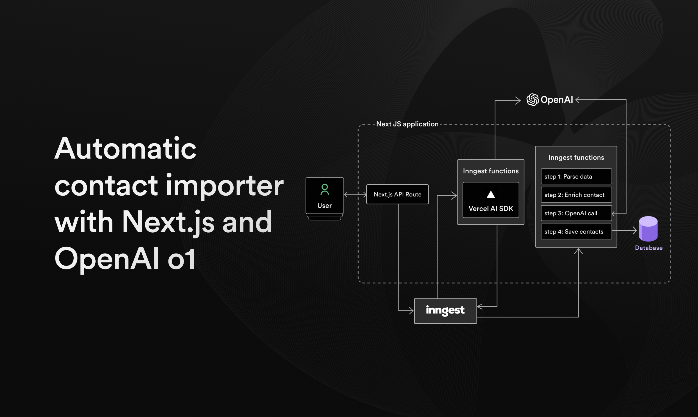

## Getting Started

1. First, install the dependencies

```bash
npm i
# or
yarn
# or
pnpm i
```

2. Then [follow the instructions to setup your Vercel Postgres](https://vercel.com/docs/storage/vercel-postgres/quickstart#prerequisites).

You can use the [`db/schema.sql`](db/schema.sql) to setup your database.

3. Then, run the development server:

```bash
npm run dev
# or
yarn dev
# or
pnpm dev
```

Open [http://localhost:3000](http://localhost:3000) with your browser to see the result.

3. Then, start the Inngest DevServer:

```bash
npx inngest-cli@latest dev
```

Open [http://127.0.0.1:8288](http://127.0.0.1:8288) with your browser to see the Inngest DevServer.

## License

[Apache License](./LICENSE)
